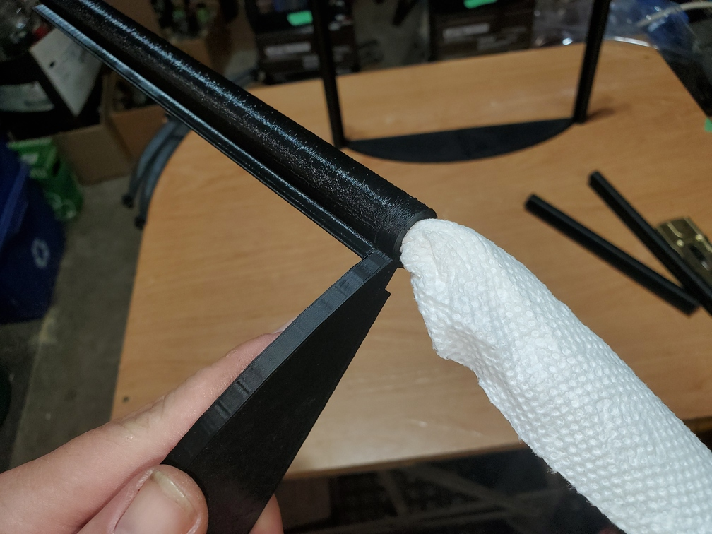
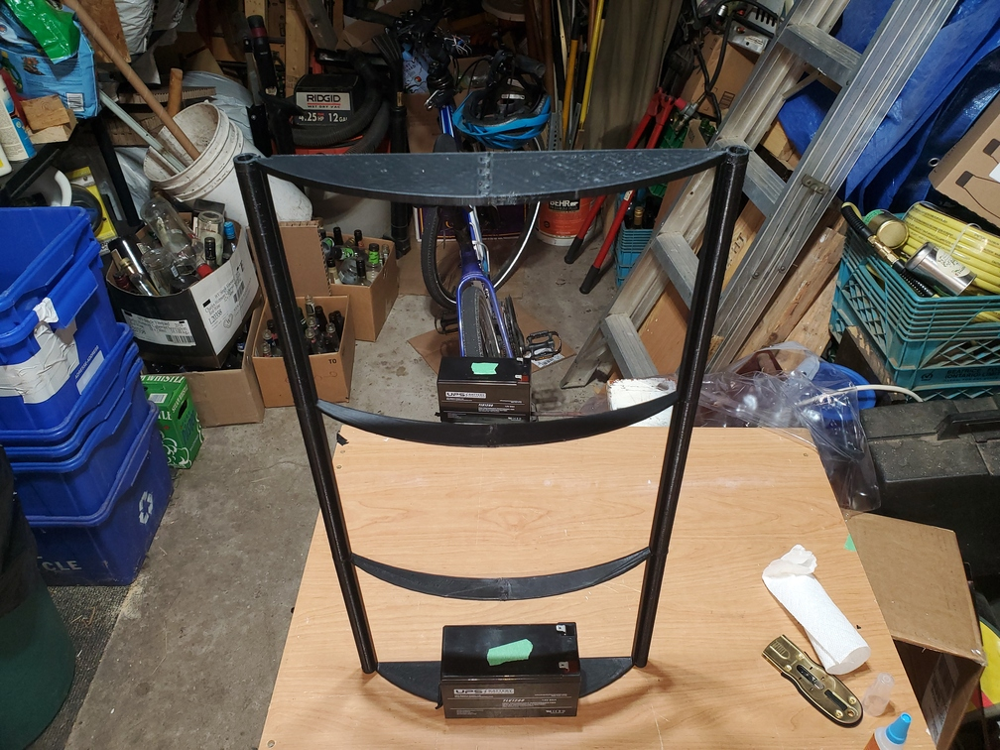

# QQ-S Pro Enclosure Instructions

These instructions complement [my Thingiverse entry for this enclosure](https://www.thingiverse.com/thing:5448123) to provide detailed, well-formatted instructions for printing and assembly of [my QQ-S Pro enclosure design](https://www.tinkercad.com/things/3qrsYrncC6p-qq-s-enclosure).

Of course, any step can be modified, but these steps outline the process I took with much trial-and-error to ensure the optimal outcome. Following them exactly should provide you a similarly nice enclosure.

## Printed Parts

 * 4x  holder.stl
 * 1x  holder-magnet-a.stl
 * 1x  holder-magnet-b.stl
 * 5x  base-left.stl
 * 1x  base-left-magnet.stl
 * 5x  base-right.stl
 * 1x  base-right-magnet.stl
 * 6x  middle-left.stl
 * 6x  middle-right.stl
 * 18x pole.stl
 * 14x spacer.stl
 * 1x  handle.stl

Use optimized QQ-S settings to make clean prints with strength and precision. I use the Cura 5.1 default QQ-S "draft" quality (0.2mm layer height) with the speed cranked right up to 200mm/s and the line width reduced to 0.3mm with no other tweaks. Brims are recommended for the poles, spacers, handles, and perhaps holders as they have small bases, but are not required for the other parts.

## Non-Printed Parts

* Cyanoacrylate superglue. I prefer Gorilla Glue brand, non-gel for this project.

* Vinyl plastic sheet, e.g. a clear vinyl shower curtain. You will need to cut out 3 roughly 475mm wide by 760mm long (18.75" wide by 30" long) pieces, so a standard shower curtain is usually sufficient. These can be had for about $10-15 at Wal-Mart or similar retailers. Be careful not to use PEVA as this does *not* work well with superglue; Vinyl was extremely successful for me. You could also use rigid plastic but that isn't what this enclosure is designed for.

* 6x 12mm x 2mm (or smaller) strong magnets for the door "locking" mechanism, e.g. [this item from Amazon](https://www.amazon.ca/Magnets-Refrigertor-Whiteboard-Durable-Multi-Use/dp/B0895QRNR8). These are not strictly required but help ensure the enclosure door remains closed during printing.

* 4x Weights (for assembly steps). I use relatively small sealed lead-acid batteries as weights though any similarly heavy, small object will work.

* Tape (for assembly steps). I use basic electrical tape.

## Assembly Instructions - Frame

1. Take one each of the left and right base halves and force them together using a plastic mallet and/or vice. 

   *For the door side frame, ensure you use a left base and a right magnet base for one, and a right magnet base and a left base for the second.*

2. Add a small dab of glue at the outside seam of the two parts, blow it into the slight gap, and wipe off the excess; this will aid in stability. Use the vice to compress this glued seam together until it cures. You can add additional glue using the same process on any other noticeable gaps between the parts.

3. Repeat the previous 2 steps for the second base and the two middles. You will be left with 2 fully assembled bases and 2 fully assembled middles.

   

4. (Door side frame only) Insert a magnet into the gap in the magnet base. Add a dab of glue to the end of one spacer piece, and insert it into the base hole such that it is contacting the magnet while ensuring the magnet is fully recessed. Allow this glue to dry to secure the magnet in place. Ensure you do this only for the magnet side, not the non-magnet side. Repeat this process for the other base piece as well.

5. Line up the bases so that the poles can be attached; ensure that the notch for the frame screws is on the bottom facing away from the poles, and ensure that the pole lip is aligned matching the direction of the curve (note the flat side alignment in the image below).

   

   *Note that this picture is post-glue, just for reference on this step, as this verification should be done flat on the table.*

6. Apply glue to the matched bottom of the pole, and carefully align it on top of the base such that the inner holes are as lined up as possible. Doing this by eye works out well as there is a slight bit of play in the holders, but you can check once the glue has partially dried but before it is fully cured, and adjust as needed; if you do this be careful of the check piece as it can quickly become attached.

   *For the door side frame, you will insert the magnet-attached spacer into this pole; this will provide additional stability in addition to the glue as well as keep the magnet firmly in place. Ensure the magnet remains fully recessed during this process.*

7. Repeat the previous 1 step for the other side of the base and for both sides of the other base.

   

8. After the glue has cured for a few minutes, clean out the inside of the holes with a paper towel to remove excess glue; it must be a firm paper towel, not a tissue or something that will easy rip off in the glue, and you must work quickly. This will ensure optimal travel onto the holders.

   

9. Insert a spacer slightly into the hole of a middle piece. Apply a few dabs of glue in the centre along the circumference.

   

10. Centre the spacer and rotate it a few times to spread the glue.

   

11. Repeat the previous 2 steps for the other side of the middle piece.

12. Using the board, align the middle along two edges and press firmly in and down to ensure the spacers are squared in the centre of the holes; you can do this by eye too but precision here will ensure the final frame is much more square.

   

13. Repeat the previous 4 steps for the other middle. Wait at least 10-15 minutes for all the glue so far to cure and stabilize.

14. Apply glue to the top of both poles on the first base piece. Insert the first middle piece's spacer pieces into the poles and press down firmly so that the glue on the pole binds to the middle piece itself. You may need to apply considerably pressure to ensure it seats all the way.

   

15. Take one of the remaining poles, and apply glue to the bottom of it ensuring correct orientation. Insert the pole into the spacer on top of the middle. Ensure it is aligned such that the outer edge of the lips on both poles match; the actual middle piece's bridge portion will be slightly recessed compared to this lip edge. Repeat this process for the other free pole on the other side.

   *At this point, the piece will start to become unstable; use a weight to hold it in place.*

   

16. Wait a few minutes for the glue from the previous steps to cure.

17. Repeat step 14 for the top of these poles and the second middle piece.

   

18. Apply glue to the top of both poles on the second base piece. Insert these poles into the second middle piece's spacer pieces and press down firmly so that the glue on the pole binds to the middle piece itself.

   

19. Wipe any excess glue from the outside of the joints to avoid accidental bonding during the next step.

20. Lay the base down and place weights on the four outer corners of the poles. This will help ensure the frame cures square. Wait at least 60 minutes in this position for the glue to fully cure. This is most important for the door side as it will have two contact points free-floating; non-door pieces can be slightly off here and will be forced square by the holders when attached to the printer.

   

21. Ensuring the polarity lines up with the magnets in the frame, insert magnets into each of the magnet holder pieces. A small amount of superglue will hold them in, but with the magnets specified in the parts list friction will keep them firmly in place.

The frame assembly is now complete.

## Assembly Instructions - Vinyl Covering

This part is definitely trickier than the frame assembly. I went through several (failed and successful) attempts before devising this exact set of steps which should minimize the hassle, wasted parts, and ensure a (relatively) taut and square sheet covering.

1. Cut a piece of vinyl to fit the enclosure. Ensure that it is slightly smaller than your board too (or get a bigger board), but leave enough excess to make assembly easy. I cut pieces approximately 475mm wide by 760mm long (18.75" wide by 30" long) as this both fits my table and comfortably fits over the frame. Use a straight edge to cut at least one long side, as this side being (almost) perfectly straight will aid in the following steps.

   

2. Line up the straight long edge of the sheet with the edge of the board, leaving approximately 1cm of overhang over the edge of the board. Tape one corner down in both directions, then pull the sheet taut along each edge and tape it down, starting with the shorter edges. Ensure your tape does not protrude too far into the long dimension of the sheet so that it does not interfere with the frame later. The more taut the sheet is here, the more pressure will be put on the frame, but the cleaner the sheet will look, so careful balance is important. I try to ensure the sheet is just slightly taut enough along the long side to avoid obvious creases.

   

3. Adjust the board on your table such that there is room past it along the flush edge of the sheet. In this case I use a Workmate table and move the board along its width to provide several inches of clearance. Note that the frame is ready to go and the weights are just off-screen in the following image.

   

4. Take the frame and apply a steady bead of glue along the lip of the poles down one entire side. Working quickly, flip the frame around and fit the corner here firmly against the edge of the board so that the "sharp" edge of the board presses the sheet firmly into the glue along the lip. Add the weights similar to what is shown to keep the frame held down against the sheet for approximately 10-15 minutes while the glue cures.

   

5. Apply additional tape about 1/3 of the way along the sheet, at about the position where the centre of the frame will contact it, to hold it taut in the long direction; this can also be done during step 2 but I choose to wait until now to ensure it properly matches the actual frame positioning.

6. With the weights still in place, gently remove the tape holding the corners where the frame is attached.

7. While holding the frame in position, gently remove the weights and place them aside.

8. Gently tilt the frame back towards you, so that the outer edges are facing up and the secured edge of the sheet folds under the remaining sheet. As shown here I use the weights as a surface to hold the frame in this position but this is not required.

   

   *Note: The following few steps are crucial to success, but due to the quick progression of events, I do not have many pictures (as pausing to take them would ruin the process). Hopefully the descriptions are sufficient; read through them several times to ensure you understand what's going on here.*

9. Apply glue along the entire lengths of the edges of both middles and bases, stopping just before the pole lip of the other side. Optionally you can skip glue on the middles but I find it provides a firmer finish with less warping.

10. Gripping the frame firmly, turn it back down with the glued edges towards the sheet, and pulling the frame firmly towards you to keep the sheet taut along the short edge, roll it slowly forward until it reaches the midpoint of the frame, but *no further*.

11. Firmly holding the frame in this position with one hand in the centre pole of the far side to avoid it slipping at all, carefully remove the extra tape applied in step 5.

12. Continue rolling the frame forward keeping it pulled towards you. By this point the sheet should be following the contour of the frame's rounded outside with the glue making contact and bonding with the sheet.

13. One the frame is rolled as far as it reasonably can while lying flat on the table, apply the weights on the far side to hold it down.

14. If all went well here, the sheet should be firmly attached to the frame by glue along all points of both bases with no gaps. There *may* be slight gaps in the middles due to uneven stretching of the plastic, folds/creases in the sheet, or minor defects in frame print, but these are less important to success.

14. Wait 5-10 minutes for the glue to cure the sheet to the frame. For a cleaner finish, wipe any excess glue from the sheet where it contacts the frame pieces. Letting the glue dry in this position should avoid any residue on the sheet.

   

16. Remove the remaining tape holding the sheet to the board, and gently remove the weights.

17. Flip the frame around so the unglued edge is facing you.

18. Apply glue along the edge and the remaining bits of the edges left unglued.

19. Use the same "edge of the board" trick as in step 4 to secure the sheet to the lip. Allow the glue to cure again, and clean up any extra glue for a clean finish.

   

20. Remove the weights and inspect the frame. The sheet should not be warped or oddly stretched.

21. Trim the excess sheet from the second pole edge and the top and bottom.

The sheet attachment is now complete.

## Assembly Instructions - Attach Sides to Printer

1. Start with the door side, determining where the opening will be.

2. Remove the bottom edge cover screws and add a normal (non-magnet) holder, reattaching with the same screws (they should be just long enough).

3. Repeat the previous 1 step with the bottom sides of the other 2 edge covers. The third should use one of the magnet holders to line up with the magnet (opening) side of the door.

4. Remove the top edge cover screws on all 3 edges to prepare for the next steps.

5. Insert the 3 enclosure pieces into their respective base holders, ensuring that they do not fall over and break the holders.

6. Starting with the door "hinge" side, insert another holder in the top and secure it; each holder will hold two pieces together.

7. Repeat the previous 1 step with the other 2 edge covers.

8. Close the door and check for gaps, etc. Gaps can be filled with spare vinyl cuttings or any other material as required.

9. If required for the door to actually remain shut, add a second magnet between each door magnet and its corresponding holder magnet; attach it to one side with superglue so the two magnets bond together.

9. Attach the door handle in an appropriate location with superglue and allow it to cure.

The enclosure is now fully assembled.

## License

This Document, the referenced 3D Designs, and all associated content (e.g. images) are Copyright ©2022 Joshua M. Boniface <joshua@boniface.me> and licensed under a Creative Commons Attribution-ShareAlike 4.0 International License.

You should have received a copy of the license along with this work under `LICENSE`. If not, see <http://creativecommons.org/licenses/by-sa/4.0/>.
